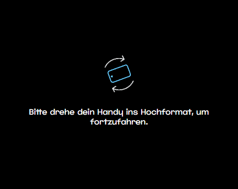

# Recruitment Project – Junior Frontend Developer

This project was created as part of a recruitment task for the position of Junior Frontend Developer.

The goal was to build a simple, interactive advertising unit presented as a mobile-responsive website.

## Task Summary

- Build a mobile-first website using provided graphic assets (background, headlines, product images, video).

- Organize the source code into clear modules/components using JavaScript (ES6+), HTML5, and SCSS.

- Use GSAP for animations and Swiper.js for an interactive product gallery.

- Compile all JS and SCSS into single bundle.js and style.css files included in the index.html.

- Host the solution in a Git repository with proper version control.

### Functional Requirements

- Responsive layout optimized for mobile devices.
- Orientation lock on mobile: if device is in landscape mode, show overlay asking to rotate to portrait and hide main content.
- Three distinct scenes:
  - Intro: shown on page load, automatically moves to the gallery after 8 seconds.
  - Gallery: shows a product image slider with navigation and a pulsing CTA button.
  - Video: displays a looping product video positioned based on the clicked gallery slide.
- Product gallery managed with a dedicated JavaScript class using Swiper.js.
- Event tracking logs key user interactions and page lifecycle events to the console.

## 🚀 Demo

[View Live](https://recruitment-beata-junior-dev-bam.netlify.app/) – Netlify

## Stack Technologies

- HTML5 + SCSS
- JavaScript (ES6+)
- Swiper.js
- GSAP
- Vite

## Features

- Responsive layout (desktop and mobile)
- Screen lock with overlay when device is in landscape orientation on mobile devices
- Custom animation timeline using GSAP for intro scene
- Product gallery where clicking different slides triggers different video behaviors.
- Videos play in a loop with sound:

  - Click on slide 1: video appears in the top-left corner.
  - Click on slide 2: video appears in the top-right corner.
  - Click on slide 3: video appears in the bottom-left corner.
  - Click on slide 4: video appears in the bottom-right corner.

- Event tracking for key interactions:
  - `ad_load`: When the page has loaded.
  - `window_resize`: Every time the browser window is resized.
  - `page_hide`: When the user leaves the page ( switches tabs).
  - `scene_change:{scene_name}`: When a specific scene becomes visible (`scene_change:intro`, `scene_change:gallery`, `scene_change:video`).
  - `user_interaction:slide_click:{slide_index}`: After clicking a slide in the gallery (e.g., `user_interaction:slide_click:1`).
  - `user_interaction:cta_click`: After clicking the CTA button.

## 🚀 Development

Clone repo:

```
git clone https://github.com/beata198/recruitment_task_bam.git
cd recruitment_task_bam
```

To run the project locally in development mode:

```
npm install       # Install all dependencies
npm run dev       # Start local development server
```

To generate the production build (bundled and optimized):

```
The source code (JavaScript and SCSS) is compiled and bundled into:

* bundle.js – final JavaScript bundle
* style.css – compiled CSS file
```

```
npm install       # Install all dependencies
npm run build
```

Run after build

```
cd dist
npm run preview
```

## Folder Structure after build

```
dist/
├── assets/
│ └── images/
│ │ ├── products/
│ │ │ ├── shoe1.jpg
│ │ │ ├── shoe2.jpg
│ │ │ ├── shoe3.jpg
│ │ │ └── shoe4.png
│ │ ├── bg.jpg
│ │ ├── headline.jpg
│ │ └── shadow.jpg
│ │ ├── video/
│ │ │ └── video.mp4.png
│ └── rotate_phone.gif
├── data/
│ └── products.json
├── fonts/
│ └── JumperPERSONALUSEONLY-Light.ttf
├── index.html
├── bundle.js
└── style.css
```

## 📸 Screenshots

### Mobile View - orientation lock



## 🎯 Technical Choice: Why Vanilla JavaScript?

This project was intentionally built using **Vanilla JavaScript (ES6+)**, without any JavaScript frameworks (like React, Vue, or Angular).

### Why this approach?

- ✅ **Lightweight**: Avoiding a framework keeps the bundle size minimal and fast to load, especially important for projects like banners or micro frontends.
- ✅ **Full control**: Using plain JS and modular architecture gives full control over DOM manipulation, performance optimization, and third-party integrations.
- ✅ **Learning showcase**: Showing a understanding of core web technologies — JavaScript, SCSS, HTML — without abstracting the logic behind a framework.

---

## Font Licensing Notice

This project uses a custom font licensed for **Personal Use Only**:

- **Font Name**: Jumper
- **License**: Personal Use
- **Source**: [https://www.mansgreback.com/font?name=jumper]

This font is used strictly for demonstration purposes in a recruitment/portfolio project and is not intended for commercial use.

The font has been embedded strictly for **non-commercial, educational, and demonstration purposes**. If you wish to use this project commercially, you must replace the font with a properly licensed alternative or purchase the appropriate license for commercial use.

Please refer to the font creator's licensing terms before reuse.
